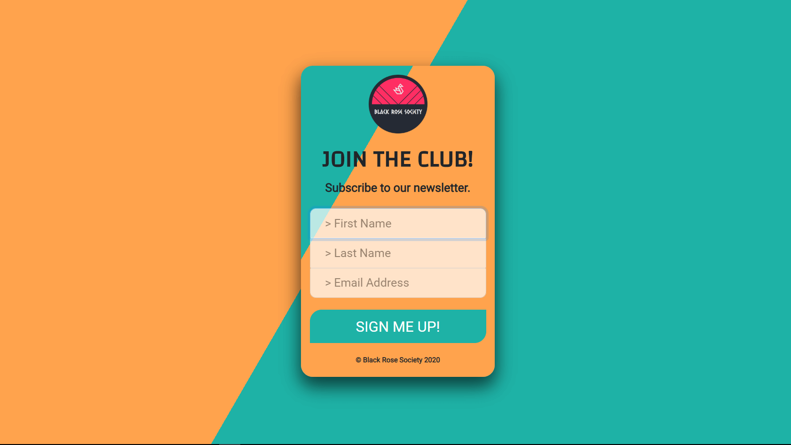
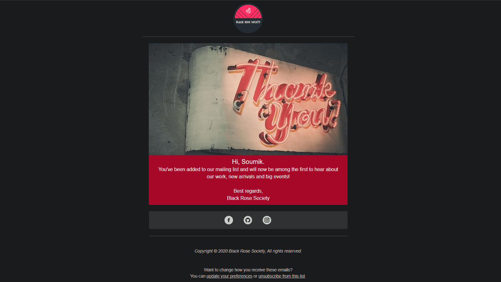

# Newsletter-SignUp-Mailchimp

## A newsletter sign up landing page created using Node.js with Express, Bootstrap and the Mailchimp API.

[](https://black-rose-society-newsletter.herokuapp.com/)

Got a campaign you want to promote but don't know how to manage your audience. Well, you've come to the right place. Automate your email sequences and engage your subscriber list with a simple yet powerful sign up page built using Mailchimp services.

Here's an example of an automated welcome email that gets sent to each subscriber as soon as they sign up for a campaign!



## Built with

- [Node.js](https://nodejs.org/) - a JavaScript runtime built on Chrome's V8 JavaScript engine.
- [Express](https://expressjs.com/) - a fast, unopinionated, minimalist web framework for Node.js
- [Bootstrap](http://getbootstrap.com/) - an open-source CSS framework which provides an extensive list of components and  Bundled Javascript plugins.
- [Mailchimp](https://mailchimp.com/) - an integrated marketing automation platform and an email marketing service.


## Installing the project

In order to run this application locally you'll need to have **Node.js** and **git** installed in your system. (**npm** comes bundled with Node)

If all the requirements are met, follow these steps to install and use `Newsletter-SignUp-Mailchimp`:

From the command line, execute the following commands:

```bash
# Clone this repository
$ git clone https://github.com/Soumik-Dhar/Newsletter-SignUp-Mailchimp.git
```
```bash
# Go into the project folder
$ cd Newsletter-SignUp-Mailchimp/
```

> Setup .env file to store environment variables

1. Rename the "**.sample-env**" file to "**.env**" file (don't forget the dot in front of the file name)
```bash
# To rename the file from the command line
$ mv .sample-env .env
```
2. Open the .env file using a text editor of your choice.

3. Replace the MAILCHIMP_API_KEY in the .env file with your Mailchimp account API key.

4. Replace the MAILCHIMP_LIST_ID in the .env file with your Mailchimp 'audience unique ID'

```bash
# Install dependencies
$ npm install
```
```bash
# Run the app
$ npm start
```
Once the server is setup, open http://localhost:3000 and take a look around!

> If you want to see the Newsletter SignUp page in action without installing the project to your local machine, click on the link below -

Link to the signup page -> [Newsletter-SignUp](https://black-rose-society-newsletter.herokuapp.com/)

## License
>You can check out the full license [here](LICENSE.md)

This project is licensed under the terms of the **MIT** license.
